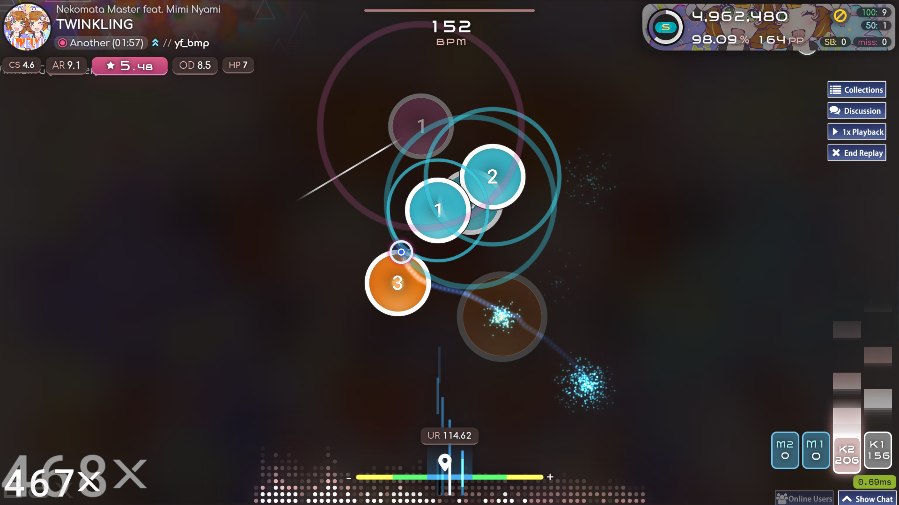
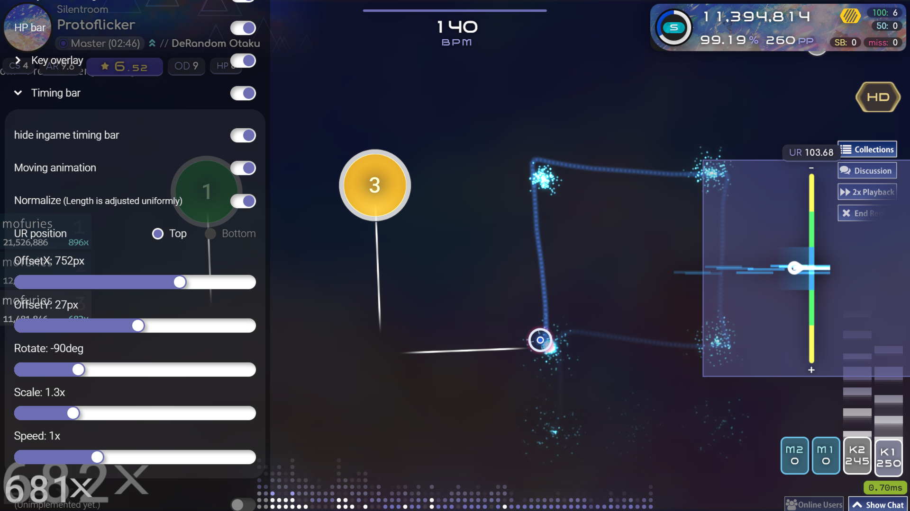
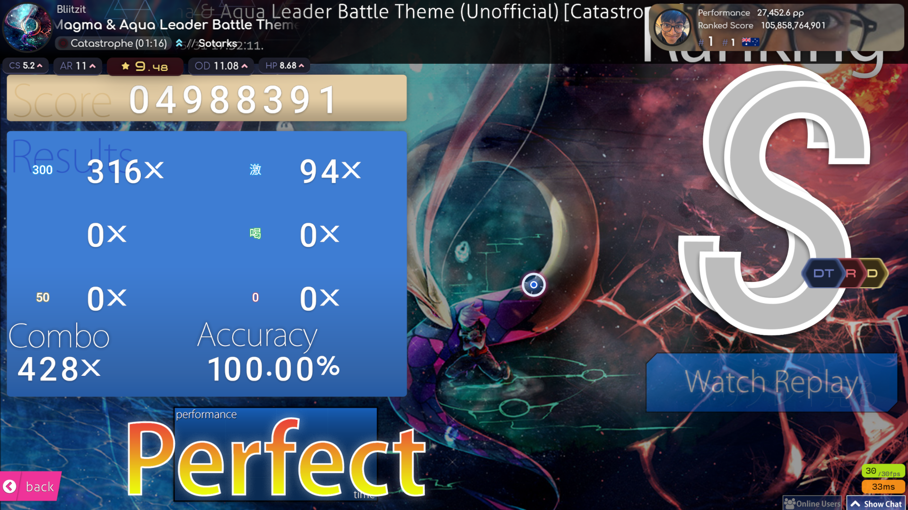
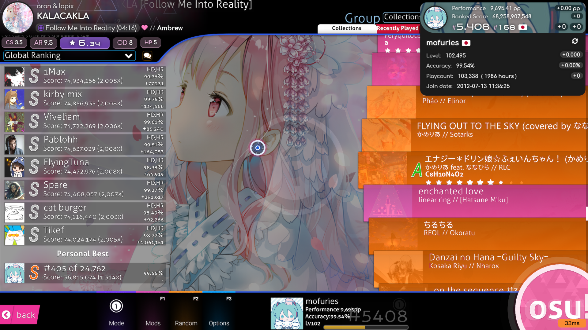

# paradox-osu-overlay

 
 

日本語の説明は[こちら](./README_JP.md)

## Overview
This is a browser-based overlay created to enhance the appearance of your osu! streaming screen. Please feel free to use this for your streams or replay recordings! (This does not alter the actual gameplay screen.)

## How to Use (with OBS Studio)
### Required Installations
- [OBS Studio (Open Broadcaster Software®)](https://obsproject.com/)  
- [StreamCompanion](https://github.com/Piotrekol/StreamCompanion)  

### Steps
1. Download the main package [here](https://github.com/mofuries/paradox-osu-overlay/archive/refs/heads/main.zip), and move the **paradox** folder into **StreamCompanion\Files\Web\overlays**. Ensure the path is **StreamCompanion\Files\Web\overlays\paradox**.

2. Launch OBS Studio, add a new source, and select "Browser". In the properties, enter the URL [**http://localhost:20727/overlays/paradox/**](http://localhost:20727/overlays/paradox/). Check the boxes for "**Control audio via OBS**", "**Shutdown source when not visible**", and "**Refresh browser when scene becomes active**". Click OK to close the properties.

3. Right-click the newly added browser source in OBS, and select **Interact**. A new window will open. Click inside this window to access the settings screen.

## Support
If you have any questions, feel free to DM me on X[(@mk_cou)](https://x.com/mk_cou). However, please note that my English isn't very good, so I appreciate your understanding.
