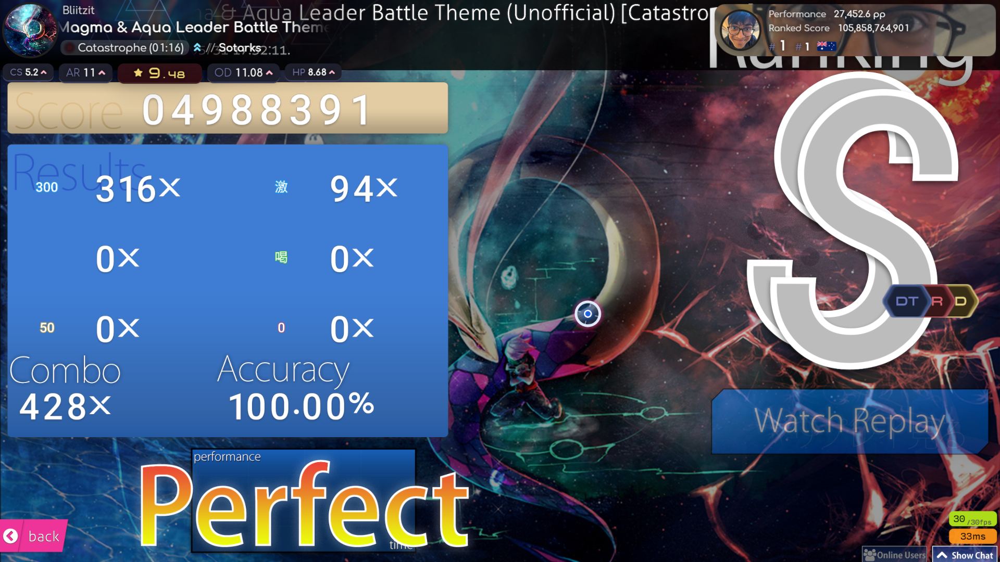

# paradox-osu-overlay

 
 

## 概要
こちらはosu!の配信画面を華やかにするために作成したブラウザベースのオーバーレイです。ぜひ配信やリプレイの録画などにご活用ください！（実際のゲーム画面を変更するものではありません。）

## 使用方法
### 事前にインストールする必要があるもの
・[OBS Studio(Open Broadcanst Software®)](https://obsproject.com/)など   
・[StreamCompanion](https://github.com/Piotrekol/StreamCompanion)、または[tosu](https://github.com/KotRikD/tosu)

### 手順 (Streamcompanionを使用する場合)
1.本体をダウンロードし、**paradox**フォルダを **StreamCompanion/Files/Web/overlays/** に移動します。 **StreamCompanion/Files/Web/overlays/paradox** という風になっていれば大丈夫です。

2.配信ソフト(例.OBS Studio)を起動しソースの追加からブラウザを選択し、プロパティのURLに[**http://127.0.0.1:20727/overlays/paradox/**](http://127.0.0.1:20727/overlays/paradox/)を入力します。"**表示されていないときにソースをシャットダウンする**"、"**シーンがアクティブになったときにブラウザの表示を更新する**"にチェックを入れOKを押してプロパティを閉じます。

### tosuを使用する場合
1.本体をダウンロードし、**paradox**フォルダを **tosu/static/** に移動します。 **tosu/static/paradox** という風になっていれば大丈夫です。

2.配信ソフトを起動しソースの追加からブラウザを選択し、プロパティのURLに[**http://127.0.0.1:24050/paradox/**](http://127.0.0.1:24050/paradox/)を入力します。"**表示されていないときにソースをシャットダウンする**"、"**シーンがアクティブになったときにブラウザの表示を更新する**"にチェックを入れOKを押してプロパティを閉じます。

## サポート
なにかあればX[(@mk_cou)](https://x.com/mk_cou)のDMでも受け付けてます。ただし英語は下手なのでそこはご了承ください。
