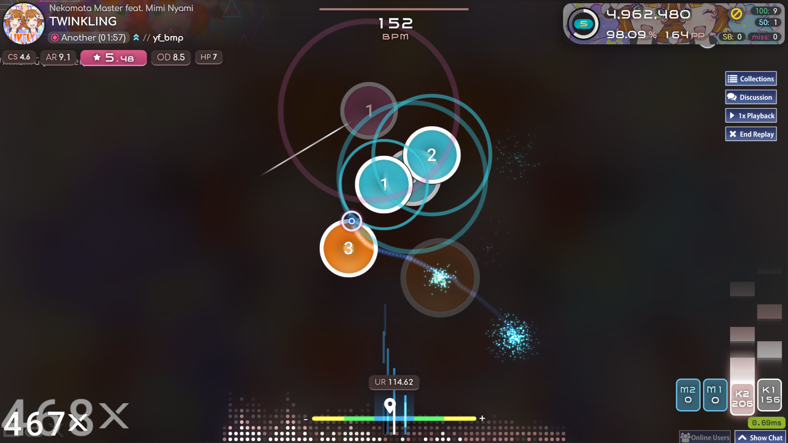
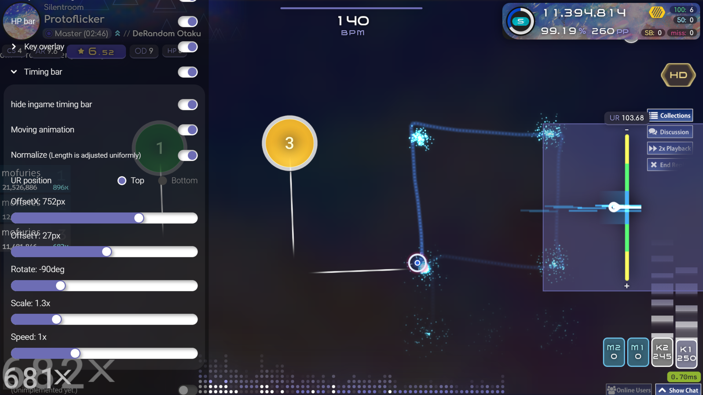

# paradox-osu-overlay

 
 

## 概要
こちらはosu!の配信画面を華やかにするために作成したブラウザベースのオーバーレイです。StreamCompanion、およびブラウザを表示できる配信ソフト(例.OBS Studio)を使用する必要があります。

## 使用方法（OBS Studioを使用）
### 事前にインストールする必要があるもの
・[OBS Studio(Open Broadcanst Software®)](https://obsproject.com/)  
・[StreamCompanion](https://github.com/Piotrekol/StreamCompanion)  

### 手順
1.本体を[ダウンロード](https://github.com/mofuries/paradox-osu-overlay/archive/refs/heads/main.zip)し、**paradox**フォルダを **StreamCompanion\Files\Web\overlays** のなかに移動します。 **StreamCompanion\Files\Web\overlays\paradox** という風になっていれば大丈夫です。

2.OBS Studioを起動しソースの追加からブラウザを選択し、プロパティのURLに[**http://localhost:20727/overlays/paradox/**](http://localhost:20727/overlays/paradox/)を入力します。"**OBSで音声を制御する**"、"**表示されていないときにソースをシャットダウンする**"、"**シーンがアクティブになったときにブラウザの表示を更新する**"にチェックを入れOKを押してプロパティを閉じます。

3.ソース内から先ほど追加したブラウザを右クリックし、**対話**を選択すると別のウィンドウが開きます。ウィンドウ内をクリックすると設定画面が出てきます。

## サポート
なにかあればX[(@mk_cou)](https://x.com/mk_cou)のDMでも受け付けてます。ただし英語は下手なのでそこはご了承ください。
